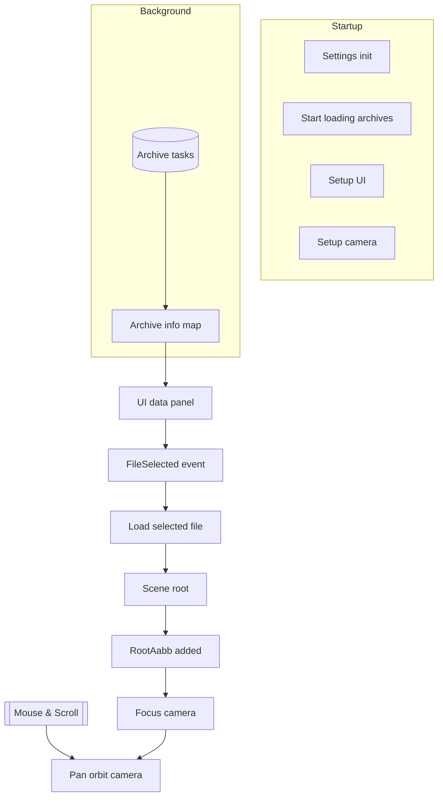

# Architecture

This document describes the current runtime architecture of the `worgen-rs` Bevy application: plugin order, system scheduling, data/asset loading flow, UI integration, camera control, and core asset abstractions. It reflects the present code in `src/` only (no historical notes).

## High‑level overview

`worgen-rs` is a desktop 3D viewer that:
1. Reads a game installation path from `assets/settings.json` (synchronously before the Bevy `App` starts).
2. Discovers and indexes data archives in the game `Data` directory.
3. Exposes their contained files (textures, generic models, large static world models, terrain map chunks) through a left egui panel.
4. Loads a single selected file at a time via the Bevy `AssetServer`, using custom asset readers and asset loaders.
5. Spawns a scene for the loaded asset and automatically frames it with a pan‑orbit camera based on a computed axis‑aligned bounding box.

All domain file types are accessed through a uniform virtual path scheme: `archive://relative/file/path`. The custom archive asset source resolves these virtual paths by reading the appropriate packed archive file transparently.

## Plugin composition (creation order in `main.rs`)

1. `ArchiveAssetReaderPlugin` – Registers the virtual `archive://` asset source (custom `AssetReader`).
2. `DefaultPlugins` (with asset meta checks disabled to avoid extraneous metadata IO).
3. `AssetPlugin` (local) – Registers custom asset types & loaders: images, models, world models, world maps, root bounding box reflection.
4. `FrameTimeDiagnosticsPlugin` – Frame timing metrics.
5. `EguiPlugin` – egui integration + schedules (notably `EguiPrimaryContextPass`).
6. `WorldInspectorPlugin` – Runtime entity/component inspector.
7. `TerrainMaterialPlugin` – Registers the extended terrain material + WGSL shader.
8. `UiPlugin` – UI camera, event (`FileSelected`) and egui side panel system.
9. `DataPlugin` – Archive discovery & indexing + file selection handling.
10. `PanOrbitCameraPlugin` – Light + camera spawn, model focus on load, orbit/pan/zoom input.

`Settings::init()` runs before building the `App`; it populates a static singleton from JSON so later systems can query paths without a Bevy resource wrapper.

## Schedules & systems

PreStartup:
* `FileArchiveMap::init` (from `AssetPlugin` via `PreStartup`) – Builds a global map from lowercase file path → archive path by scanning all archives once.

Startup:
* `archive::start_loading` (DataPlugin) – Spawns one async task per archive to extract categorized file lists.
* `ui::select_default_model` (DataPlugin) – Emits a `FileSelected` event for the default model path from settings (if provided).
* `camera::setup_camera` (PanOrbitCameraPlugin) – Spawns a directional light and a pan‑orbit camera entity.
* `ui::setup_ui` (UiPlugin) – Creates a dedicated 2D camera for egui with isolated render layers.

PreUpdate:
* `camera::on_model_loaded` – Detects newly added `RootAabb` components (i.e., a loaded scene root) and re‑centers the camera.

Update:
* `archive::check_archive_loading` (DataPlugin, conditional while `LoadArchiveTasks` exists) – Polls archive tasks; inserts each completed `ArchiveInfo` into `ArchiveInfoMap` or emits an error exit if a task fails.
* `data::load_selected_file` – Consumes only the most recent `FileSelected` event, despawns any previous `CurrentFile` scene root (and unloads its handle in the file map), initiates loading of the newly selected file by requesting the appropriate asset label through the `AssetServer`.
* `camera::pan_orbit_camera` – Handles orbit / pan / zoom input while pointer is not captured by egui.

Egui (`EguiPrimaryContextPass`):
* `ui::data_info` – Renders the left side panel, listing archives and categorized file entries; clicking an entry emits `FileSelected`.

## Core resources & global state

Resource structs:
* `ArchiveInfoMap` – Path → `ArchiveInfo` (lists of texture, model, world model, and world map file paths contained in each archive).
* `FileInfoMap` – Lowercase file path → `FileInfo` (archive path + inferred `DataType` + optional Bevy handle and load state helpers).
* `LoadArchiveTasks` – Collection of in‑flight async tasks producing `ArchiveInfo`.

Global singletons (static):
* `Settings` – Parsed from `assets/settings.json` once.
* `FileArchiveMap` – Global mapping file path → archive path used by the custom `AssetReader`.

Events:
* `FileSelected { file_path: String }` – Emitted by UI or startup selection, drives asset loading.

Components:
* `CurrentFile { path }` – Tag on the spawned scene root entity for the currently selected asset.
* `PanOrbitState` & `PanOrbitSettings` – Runtime state and configuration for camera controller.
* `RootAabb` – Axis‑aligned bounding box (merged across meshes) placed on scene root entities by loaders; used for focusing.

## File classification & data types

`FileInfoMap` infers a `DataType` enum for each discovered file by extension:
* `Texture` – Image data (loaded by a custom image loader) used by materials.
* `Model` – A standalone 3D model asset (meshes + materials + textures).
* `WorldModel` – A large, potentially multi‑group static structure. Loader fetches its group files, images, creates materials & meshes.
* `WorldMap` – A terrain chunk collection (and references to embedded models / world models) plus layer alpha masks.
* `Unknown` – Anything else (ignored by UI filtering except for unknown category collapsible headers).

Textures and model/material dependencies are requested automatically by asset loaders; the UI never schedules them directly.

## Custom asset source & virtual paths

The `ArchiveAssetReaderPlugin` registers a `Name("archive")` asset source. Any Bevy load path beginning with `archive://` is resolved by:
1. Lowercasing the file path.
2. Looking up its archive via `FileArchiveMap`.
3. Opening the archive file and reading the contained file into memory (currently fully synchronous per request; higher‑level Bevy IO handles async scheduling).

This abstracts archive layout details away from higher layers and lets all loaders reuse normal `AssetServer` semantics.

## Asset loaders

Image loader (`image.rs`):
* Converts raw texture bytes into Bevy `Image` objects (RGBA8) selecting sampler settings where required.

Model loader (`model.rs`):
* Parses model bytes, collects referenced texture paths (falling back to a configurable test image if a path is empty or not directly specified), builds meshes + standard materials for each batch, computes a combined `RootAabb`, constructs a `Scene` containing the reoriented meshes, and labels sub‑assets (meshes/materials/images) so selective loading is possible.

World model loader (`world_model.rs`):
* Parses a root structure file then loads its group files, gathers textures with per‑material sampler customization, builds meshes per render batch, assigns materials with alpha/culling/unlit flags, computes `RootAabb`, and emits a labeled scene.

World map loader (`world_map.rs`):
* Parses a terrain map definition: height data, texture layer references, embedded model/world model references, and alpha layers.
* Builds one mesh per terrain chunk (145‑vertex layout) plus a packed RGBA alpha mask texture (channels correspond to up to three higher texture layers).
* Creates an extended material (`ExtendedMaterial<StandardMaterial, TerrainMaterial>`) feeding the shader with layer count and alpha/texture handles.
* Computes a merged `RootAabb` from transformed chunk meshes and assembles a scene with terrain chunk entities. (Referenced models/world models are requested; their individual spawning is handled as those assets load.)

Common orientation: loaders apply a consistent reorientation (rotate −90° around X then −90° around Z) before computing bounding boxes and building the scene so camera framing matches visual placement.

## UI layer

The egui side panel (`ui::data_info`):
* Iterates `ArchiveInfoMap` → lists categorized file paths.
* Displays per‑file load state icons (▶ not loaded, ⏳ loading, ✔ loaded, ✖ failed) using `RecursiveDependencyLoadState` queries via `AssetServer` and the stored handle in `FileInfo`.
* Emits a single `FileSelected` event when a path row is clicked (debounced by ignoring tooltip open interactions).
* Adjusts the primary 3D camera viewport to avoid rendering underneath the panel by shrinking the viewport horizontally each frame if the panel width changes.

## Selection & scene lifecycle

1. User clicks a file → `FileSelected` event.
2. `load_selected_file` keeps only the latest selection per frame.
3. If the same path is already active, it no‑ops; otherwise:
   * Despawns the previous `CurrentFile` root (removing all spawned children).
   * Resets previous file handles (so re‑selection triggers fresh loads if not cached elsewhere).
   * Loads the selected path via an asset label (`ModelAssetLabel::Root`, `WorldModelAssetLabel::Root`, `WorldMapAssetLabel::Root`) or direct `SceneRoot` for unknown types.
   * Spawns an entity with `CurrentFile` + `SceneRoot(handle)`.
4. When the underlying scene finishes loading, its root entity (from the scene) includes a `RootAabb`. The `on_model_loaded` system (Added<RootAabb>) focuses the camera.

## Camera & focusing

Pan‑orbit controller features:
* Modifier‑key based mode switching (pan / orbit / zoom) plus scroll wheel zoom by default.
* Accumulates raw mouse motion & scroll events each frame; applies exponential radius scaling for zoom.
* Maintains yaw/pitch with wrapping and handles an upside‑down flag to keep orbit directions intuitive.

Auto‑focus:
* Triggered when a new `RootAabb` appears (no explicit event needed).
* Camera radius = length of half‑extents * comfort factor (clamped by a minimum) and center = bounding box center.
* Only repositions if a new asset loads; ongoing manual camera motion is preserved across selections except center/radius changes.

## Bounding volumes

`RootAabb` utilities:
* Can derive from a single mesh + transform or merge multiple meshes (either already transformed or transformed later).
* Combine logic merges min/max extents; aabb transformation applies rotation + non‑uniform scale preserving correctness for reoriented scenes.

## Materials & terrain shader

* Standard models/world models: `StandardMaterial` with alpha mode derived from blend/mask flags.
* Terrain: extended material with:
  * Base color + up to three additional layer textures.
  * Combined alpha texture packing layer masks into RGB channels.
  * Layer count to branch cheaply in WGSL.

## Error handling & load states

* Archive loading failures log an error and request an error exit.
* Individual asset load failures surface as a red ✖ icon in the UI with the error message in the collapsing header body.
* Selection of a file already marked failed leaves the previous scene intact (no special recovery yet).

## Concurrency notes

* Archive info extraction uses dedicated async tasks (IO task pool). Results are polled each frame; incomplete tasks are returned to the queue.
* Asset loading (images, models, world models, world maps) leverages Bevy's internal async asset pipeline; no custom polling system is required beyond selection logic.

## Mermaid overview

## Execution details

* Only the most recent selection per frame is acted upon (low churn when rapidly clicking).
* UI camera isolates egui rendering; world camera viewport is shrunk horizontally to avoid overdraw under the panel.
* Reorientation (two axis rotations) is applied consistently by loaders before computing bounding volumes to keep focusing accurate.
* Load state icons prevent accidental repeated clicks during asset resolution.

## Potential enhancements

1. Replace global mutable `Settings` with a Bevy resource plugin (thread safety & hot‑reload potential).
2. Archive file watching (development mode) to refresh `ArchiveInfoMap` and `FileInfoMap` without restart.
3. Progressive world map streaming (load visible chunks first, prioritize camera frustum).
4. Batched or cached archive file reads to reduce repeated open/seek costs for dependent textures.
5. Optional asset caching / LRU eviction for large scenes to cap memory usage over long sessions.
6. Smooth camera focus animation (tween center/radius) instead of instantaneous jump.
7. Configurable input mapping + gamepad support for camera control.
8. In‑UI diagnostics panel (mesh/material counts, memory estimates, per‑category load timings).
9. Robust error surface: dedicated panel listing failed file loads with retry button.
10. Terrain shader improvements (normal mapping, triplanar blend, texture array consolidation to reduce bind group churn).
11. Parallel world model group loading progress indicator in UI.
12. Headless mode (no UI) for automated asset validation / CI test harness.
13. Merge small meshes that share material to reduce draw calls (post‑load optimization pass).
14. Add frustum culling hints or hierarchical bounding volumes for large map scenes.

