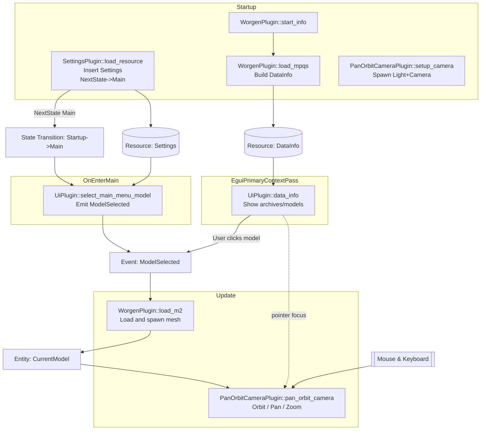

# Architecture

This document describes the runtime architecture of the `worgen-rs` Bevy application, focusing on the systems and plugins wired together in `main.rs` and how data + events flow between them.

## Plugin Composition

`main.rs` builds the `App` as follows (order shown is the order added):

1. `DefaultPlugins` – core Bevy engine (scheduling, rendering, assets, input, etc.)
2. `init_state::<GameState>()` – registers the `GameState` state machine (initial state = `Startup`).
3. `EguiPlugin` – integrates egui and adds UI-specific schedules / passes including `EguiPrimaryContextPass`.
4. `SettingsPlugin` – loads app settings at Startup and transitions to `GameState::Main` when ready.
5. `UiPlugin` – defines the `ModelSelected` event, selects an initial model on `OnEnter(GameState::Main)`, and renders the data browser in an egui window (during `EguiPrimaryContextPass`).
6. `WorgenPlugin` – loads MPQ archives + builds an index of contained assets (Startup) and responds to `ModelSelected` events by spawning meshes (Update).
7. `PanOrbitCameraPlugin` – spawns the directional light + camera (Startup) and updates camera orbit each frame (Update).

## Schedules & System Sets

Startup schedule systems:
- `SettingsPlugin::load_resource` – Inserts `Settings` resource and requests state change to `GameState::Main`.
- `WorgenPlugin::start_info` then (chained) `WorgenPlugin::load_mpqs` – Logs a banner and builds `DataInfo` (archives + models + WMOs), inserting it as a resource.
- `PanOrbitCameraPlugin::setup_camera` – Spawns light + camera entity (with `PanOrbitState` + `PanOrbitSettings`).

State transition:
- When `load_resource` sets `NextState<GameState>::Main`, Bevy performs the state transition after Startup completes; `OnEnter(GameState::Main)` then runs.
- `UiPlugin::select_main_menu_model` (OnEnter `Main`) emits an initial `ModelSelected` event based on `Settings.default_model`.

Update schedule systems:
- `WorgenPlugin::load_m2` – Listens for `ModelSelected` events; loads the selected model from its MPQ archive, converts it into one or more `Mesh` assets, despawns previously spawned `CurrentModel` entity/entities, and spawns the new mesh entity tagged with `CurrentModel`.
- `PanOrbitCameraPlugin::pan_orbit_camera` – Applies user input (unless the egui UI wants pointer input) to manipulate camera orbit, pan, and zoom.

Egui pass (`EguiPrimaryContextPass`):
- `UiPlugin::data_info` – Renders an "Info" window showing loaded MPQ archives and their contained M2 / WMO entries (`DataInfo`). Clicking a model header (collapsing header) writes another `ModelSelected` event, retriggering the asset load pipeline.

## Data & Event Flow Summary

Resources established early: `Settings`, then `DataInfo`. These gate later systems via run conditions:
- `select_main_menu_model` has `run_if(resource_exists::<Settings>)` (ensuring settings are present when `OnEnter(Main)` fires).
- `data_info` has `run_if(resource_exists::<DataInfo>)` (so the window only appears after MPQs are indexed).

User interaction (model selection in the UI) or initial state entry both produce `ModelSelected` events, handled by `load_m2` to (re)spawn the current model mesh.

Camera input is suppressed while the egui UI wants pointer focus to avoid conflicting interactions.

## Mermaid Diagram

## Execution Ordering Notes

- `start_info` and `load_mpqs` are chained; `load_mpqs` only runs after `start_info` completes.
- Startup system ordering across different plugins is not explicitly constrained here; any hard dependency (e.g., needing `DataInfo`) is managed via run conditions instead of explicit ordering.
- The initial `ModelSelected` event is generated only once (via `OnEnter(Main)`); subsequent ones are user-driven from the UI.
- `load_m2` processes at most one event per frame (`if let Some(event) = event_reader.read().next()`), ignoring additional selections until later frames—this effectively debounces rapid clicks.

## Potential Enhancements

- `load_mpqs` is a slow operation; consider adding a `Loading` game state to show a progress indicator while MPQs are indexed. Then transition to `Main` when done.
- Process all pending `ModelSelected` events (retain only the latest) to ensure UI responsiveness with rapid clicks.
- Add run condition so `load_m2` only runs when there are unread events (minor perf gain).
- Defer expensive model load to a separate task pool to keep frame times smooth.
- Add system ordering to guarantee MPQs load before state transition (currently relies on both being in Startup and quick execution).
