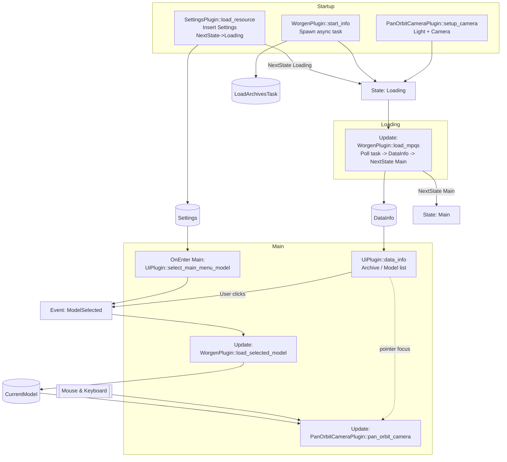

# Architecture

This document explains the runtime architecture of the `worgen-rs` Bevy application: plugin ordering, states, system scheduling, and data / event flow after introducing an asynchronous archives loading task.

## Plugin Composition

`main.rs` builds the `App` in this order:

1. `DefaultPlugins` – Core Bevy engine (rendering, input, asset system, schedules, etc.)
2. `FrameTimeDiagnosticsPlugin` – Provides frame timing diagnostics
3. `init_state::<GameState>()` – Registers the `GameState` state machine (`Startup` initial)
4. `EguiPlugin` – Integrates egui + adds the `EguiPrimaryContextPass`
5. `SettingsPlugin` – Loads settings during `Startup`, then transitions to `Loading`
6. (No dedicated loading UI plugin currently; a static UI could be added later)
7. `UiPlugin` – Declares `ModelSelected` event, selects initial model on `OnEnter(Main)`, shows archive/model browser UI
8. `WorgenPlugin` – Logs banner (`Startup`), spawns an async archive loading task (resource), polls it each frame (`Update`) inserting `DataInfo` when ready, loads selected model meshes (`Update`)
9. `PanOrbitCameraPlugin` – Spawns light + orbit camera (`Startup`), updates camera controls each frame (`Update`)

## Schedules & System Sets

Startup schedule systems:
- `SettingsPlugin::load_resource` – Inserts `Settings`, sets `NextState(GameState::Loading)`
- `WorgenPlugin::start_info` – Logs banner and spawns async archive load task (`LoadArchivesTask` resource)
- `PanOrbitCameraPlugin::setup_camera` – Spawns light + orbit camera

State transitions:
1. `Startup` -> `Loading` (requested by settings load system)
2. `Loading` -> `Main` (requested when async archive task completes in `WorgenPlugin::load_mpqs` polling system)

Systems tied to states:
- `OnEnter(Main)`: `UiPlugin::select_main_menu_model` (emits initial `ModelSelected`)

Frame schedules of interest:
- `Update`: `WorgenPlugin::load_mpqs` (poll async task when `LoadArchivesTask` resource exists; inserts `DataInfo`, sets next state to `Main` on completion)
- `Update`: `WorgenPlugin::load_selected_model` (respond to most recent selection event and spawn meshes)
- `Update`: `PanOrbitCameraPlugin::pan_orbit_camera` – Orbit/pan/zoom input (skips when egui wants pointer)
- `EguiPrimaryContextPass`: `UiPlugin::data_info` (only after `DataInfo` exists and state is `Main`)

Egui pass (`EguiPrimaryContextPass`):
- `UiPlugin::data_info` – Active in `Main` when `DataInfo` resource exists (lists archives, models, WMOs; emits `ModelSelected` on click)

## Data & Event Flow Summary

Resource availability timeline:
1. `Settings` inserted in `Startup`
2. `LoadArchivesTask` inserted in `Startup` (async task running)
3. `DataInfo` inserted when task completes (during `Update` while in `Loading`)
4. Initial `ModelSelected` emitted in `OnEnter(Main)` (after `DataInfo` exists)

Run conditions:
- `UiPlugin::data_info` runs only if `DataInfo` exists
- Initial selection system (`select_main_menu_model`) only runs once on entering `Main`

User interaction (model selection) or the initial `OnEnter(Main)` selection both produce a `ModelSelected` event. `load_selected_model` consumes only the most recent event each frame and respawns the `CurrentModel` entity/entities.

Camera input is suppressed while the egui UI wants pointer focus to avoid conflicting interactions.

## Mermaid Diagram

## Execution Ordering Notes

- Asynchronous task (spawned in Startup) keeps the main thread responsive; polling occurs each `Update` while in `Loading`.
- State transition to `Main` only occurs after `DataInfo` is inserted.
- `load_selected_model` processes only the final event each frame (debounce) during `Update`.

## Potential Enhancements

- Add a lightweight loading UI (progress bar) while polling the async task.
- Provide progress events from the task via a channel to show per-archive status.
- Move heavy parsing sub-steps to `spawn_blocking` if CPU contention appears.
- Add asset caching layer / hot-reload for modified archive files in dev mode.
