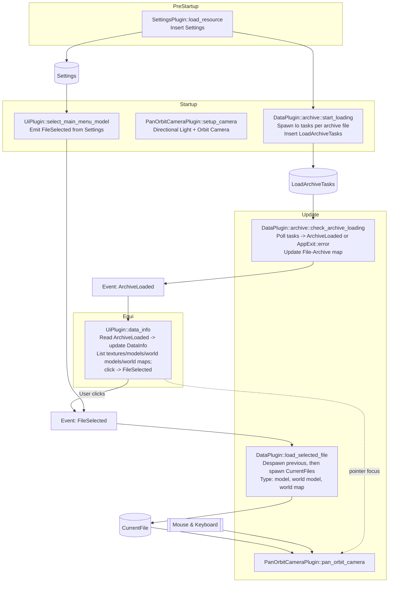

# Architecture

This document describes the current runtime architecture of the `worgen-rs` Bevy application: plugin ordering, schedules, and data/event flow. It includes asynchronous, parallel archive loading and an egui-based browser for textures, models (including grouped world models), and world maps.

## Plugin Composition

`main.rs` builds the `App` in this order:

1. `DefaultPlugins` – Core Bevy engine (rendering, input, assets, schedules, etc.)
2. `FrameTimeDiagnosticsPlugin` – Frame timing diagnostics
3. `EguiPlugin` – Integrates egui and adds the `EguiPrimaryContextPass`
4. `WorldInspectorPlugin` – Live world/entity inspector via egui
5. `CustomMaterialPlugin` – Registers a custom material/shader (currently not used by the loaders, which use `StandardMaterial`)
6. `SettingsPlugin` – Loads settings during `PreStartup`
7. `UiPlugin` – Declares `FileSelected` event, owns `DataInfo`, renders archive browser UI
8. `DataPlugin` – Starts parallel archive loading tasks (`Startup`), polls their completion (`Update`), and loads meshes for the selected file (`Update`)
9. `PanOrbitCameraPlugin` – Spawns directional light + orbit camera (`Startup`), updates camera controls (`Update`)

## Schedules & System Sets

PreStartup:
- `SettingsPlugin::load_resource` – Inserts `Settings` from `assets/settings.json`.

Startup:
- `archive::start_loading` (in `DataPlugin`) – Creates `LoadArchiveTasks` and spawns async IO tasks (one per archive file discovered under a configured data directory).
- `PanOrbitCameraPlugin::setup_camera` – Spawns directional light and the orbit camera bundle.
- `UiPlugin::select_main_menu_model` – Emits a `FileSelected` for the default model from `Settings` (used to load an initial scene).

Update:
- `archive::check_archive_loading` (in `DataPlugin`) – Polls `LoadArchiveTasks` and emits `ArchiveLoaded` for each finished archive; on error, logs and requests `AppExit::error`.
- `data::load_selected_file` – Consumes the most recent `FileSelected` event per frame, despawns any `CurrentFile`, loads the selected asset from the chosen archive, and spawns new mesh/material entities. Supports models, world models (including grouped/batched), and world maps (referencing models/world models with placements).
- `PanOrbitCameraPlugin::pan_orbit_camera` – Orbit/pan/zoom input; ignores input while egui wants the pointer (prevents interaction conflicts).

Egui pass (`EguiPrimaryContextPass`):
- `UiPlugin::data_info` – Reads `ArchiveLoaded` events, appends to the `DataInfo` resource, and renders a scrollable window listing archives with textures, models, world models (with per-group stats), and world maps (listing referenced models/world models). Clicking an item emits `FileSelected`.

## Data & Event Flow

Runtime inputs and resources:
- `Settings` are loaded from `assets/settings.json` at startup. Paths in settings reference an archive and the model file to open by default.
- A configurable data directory (for example provided via an environment variable) is scanned for archives under a `Data` subfolder.

Flow overview:
1. `Settings` is inserted in `PreStartup`.
2. `archive::start_loading` discovers archive files and spawns one async task per archive on the Io task pool, storing them in `LoadArchiveTasks`.
3. `archive::check_archive_loading` polls tasks each frame and emits `ArchiveLoaded { archive: ArchiveInfo }` as they complete; on failure, it logs and triggers `AppExit::error`. It also updates a File→Archive map for models, textures, world models, and world maps.
4. `UiPlugin::data_info` ingests `ArchiveLoaded` events and updates `DataInfo.archives`, rendering a hierarchical view (Archive → textures/models/world models/world maps). Clicking emits `FileSelected`.
5. `UiPlugin::select_main_menu_model` emits a `FileSelected` using `settings.default_model` to drive an initial load.
6. `data::load_selected_file` reads only the last `FileSelected` per frame, opens the selected archive, and loads using internal loaders by type:
    - Models → spawns one entity per submesh batch.
    - World models → loads the asset and its groups, creates materials/textures, spawns one entity per batch per group.
    - World maps → discovers referenced models/world models and spawns them with placements (translation/scale; rotation when available).
    Each spawned entity is tagged `CurrentFile`. Previous `CurrentFile` entities are despawned first.
7. Camera controls update every frame; input is skipped when egui has pointer focus.

## Mermaid Diagram

## Execution Notes

- Archive discovery and parsing run on async tasks; the main thread remains responsive while tasks complete in the background.
- The UI receives `ArchiveLoaded` incrementally and updates the browser immediately.
- `load_selected_file` only processes the most recent selection per frame to avoid redundant loads within the same frame.
- Camera input is disabled while egui wants the pointer to prevent conflicting interactions.
- Spawned meshes use `StandardMaterial`. The `CustomMaterialPlugin` is currently unused by loaders and reserved for future experiments.
- Spawned models are reoriented on spawn to the app’s convention: rotate −90° around X and −90° around Z.

## Potential Enhancements

- Progress reporting for archive scanning and parsing (e.g., progress bar fed by per-archive progress events).
- Error panel for non-fatal issues collected during parsing, displayed in an egui diagnostics window.
- Optional file watching in dev mode to rescan archives and refresh `DataInfo` on changes.
- Introduce custom Bevy assets for models/world models/world maps to leverage asset server caching and dependency tracking.
- Lightweight telemetry in UI (mesh/material counts, vertex/index totals) and optional frame-time overlay segment.
- Camera UX niceties: inertia/smoothing, reset-to-origin, focus camera on loaded model bounds.
- World map placement rotation/orientation: apply when available from map data.

