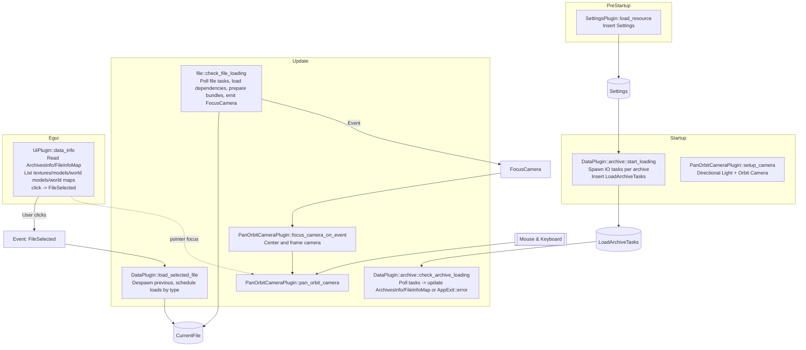

# Architecture

This document describes the current runtime architecture of the `worgen-rs` Bevy application: plugin ordering, schedules, resources/events, and the data flow for asynchronous archive and file loading with an egui-based browser for textures, models (including grouped world models), and world maps.

## Plugin composition

`main.rs` builds the `App` in this order:

1. `DefaultPlugins` – Core Bevy engine (rendering, input, assets, schedules, etc.)
2. `FrameTimeDiagnosticsPlugin` – Frame timing diagnostics
3. `EguiPlugin` – Integrates egui and provides the `EguiPrimaryContextPass`
4. `WorldInspectorPlugin` – Live world/entity inspector via egui
5. `CustomMaterialPlugin` – Registers a custom material/shader (loaders use `StandardMaterial`)
6. `SettingsPlugin` – Loads `Settings` during `PreStartup`
7. `UiPlugin` – Declares the `FileSelected` event, owns the `ArchivesInfo` resource, renders the archive browser UI
8. `DataPlugin` – Starts parallel archive loading tasks (`Startup`), polls their completion and updates resources (`Update`), and drives file loading and instantiation (`Update`)
9. `PanOrbitCameraPlugin` – Declares the `FocusCamera` event, spawns a directional light + orbit camera (`Startup`), focuses the camera on demand and updates camera controls (`Update`)

## Schedules

PreStartup:
- `SettingsPlugin::load_resource` – Inserts `Settings` from `assets/settings.json`.

Startup:
- `archive::start_loading` (in `DataPlugin`) – Scans the configured data directory for archives, spawns one async IO task per archive, and stores them in `LoadArchiveTasks`.
- `PanOrbitCameraPlugin::setup_camera` – Spawns a directional light and the orbit camera bundle.

Update:
- `archive::check_archive_loading` (in `DataPlugin`) – Polls `LoadArchiveTasks`. On success, appends `ArchiveInfo` into `ArchivesInfo` and updates `FileInfoMap`. On failure, logs and requests `AppExit::error`.
- `data::load_selected_file` – Consumes only the most recent `FileSelected` each frame, despawns any `CurrentFile`, schedules file loading tasks, and marks file state transitions.
- `file::check_file_loading` – Polls file loading tasks, fans out dependency loads (textures, referenced models/world models), instantiates meshes when dependencies are ready, and emits a `FocusCamera` event with computed bounds.
- `PanOrbitCameraPlugin::focus_camera_on_event` – Centers and frames the orbit camera around the provided bounding sphere, applying a comfort multiplier and minimum radius.
- `PanOrbitCameraPlugin::pan_orbit_camera` – Orbit/pan/zoom input; ignores input while egui wants the pointer.

Egui pass (`EguiPrimaryContextPass`):
- `UiPlugin::data_info` – Reads `ArchivesInfo` and `FileInfoMap`, and renders a scrollable browser (archives → textures/models/world models/world maps). Clicking an item emits `FileSelected`.

## Resources, events, and components

- Resources: `Settings`, `ArchivesInfo`, `FileInfoMap`, `LoadArchiveTasks`, `LoadingFileTasks`.
- Events: `FileSelected { file_path: String }`, `FocusCamera { bounding_sphere }`.
- Components: `CurrentFile { path }` (tags spawned entities for the active file).

## Data and event flow

1. Settings are loaded in `PreStartup`.
2. At `Startup`, archive discovery spawns one IO task per archive under the configured data directory. Each task produces an `ArchiveInfo` with lists of known texture/model/world model/world map paths.
3. Each completed archive task is appended to `ArchivesInfo`, and `FileInfoMap` is filled with entries mapping file path → archive path and inferred data type.
4. The egui UI reads `ArchivesInfo`/`FileInfoMap` and displays an archive → files hierarchy. Clicking a file emits `FileSelected`.
5. `load_selected_file` keeps only the last selection per frame, despawns any `CurrentFile` entities (and resets their state to `Unloaded`), and schedules a load task for the selected file by type:
   - Model → schedule model load
   - World model → schedule world model load (root + its groups)
   - World map → schedule world map load (later drives referenced models/world models)
   Textures are loaded as dependencies; they aren’t scheduled directly from the UI.
6. `file::check_file_loading` polls tasks and handles dependency fan-out:
   - When a model or world model finishes loading, it schedules any missing textures, waits until they’re all loaded, then prepares spawn bundles.
   - When a world map finishes, it schedules any missing models/world models it references, waits for them to be ready, then prepares placement bundles.
   - Before spawning, a world-space bounding sphere is computed from the prepared bundles (applying the same reorientation as spawning). A `FocusCamera` event is emitted with this sphere.
   - Texture loads update `FileInfoMap` immediately.
7. When dependencies are ready and instantiation is requested, meshes and materials are created and spawned. New entities are tagged with `CurrentFile`. Model bundles are reoriented to the app’s convention: rotate −90° around X and −90° around Z. World map placements apply translation/rotation and scale (for models) from placement data.
8. `focus_camera_on_event` receives the most recent focus request per frame and centers the camera on the provided sphere, multiplying radius by a comfort factor and enforcing a minimum radius. Camera input is ignored while egui wants pointer input to prevent conflicts.

## Camera controls

- Orbit/pan/zoom are bound to modifier keys by default:
  - Pan: hold Left Control
  - Orbit: hold Left Alt
  - Zoom: hold Left Shift
- Scroll wheel performs zoom by default (line and pixel sensitivities are supported).
- The controller automatically handles upside-down orbiting to keep controls intuitive.

## Mermaid diagram

## Execution notes

- Archive discovery and parsing run on async tasks; the main thread remains responsive while tasks complete in the background.
- The UI reflects archives as they complete by reading from the `ArchivesInfo` resource; no explicit “archive loaded” event is used.
- `load_selected_file` only processes the most recent selection per frame to avoid redundant work.
- Spawned meshes use `StandardMaterial`; the custom material plugin is available for experiments.
- Model entities are reoriented on spawn by rotating −90° around X and −90° around Z. Bounding computations use the same reorientation to match spawned transforms.
- Camera input is disabled while egui wants the pointer to prevent interaction conflicts.

## Potential enhancements

- Progress reporting for archive scanning and parsing (e.g., per-archive progress in the UI).
- Error panel for non-fatal issues collected during parsing, displayed in an egui diagnostics window.
- Optional file watching in dev mode to rescan archives and refresh `ArchivesInfo`/`FileInfoMap` on changes.
- Promote loaders to custom Bevy assets for models/world models/world maps to leverage asset server caching and dependency tracking.
- Lightweight telemetry in UI (mesh/material counts, vertex/index totals) and optional frame-time overlay segment.
- Camera UX improvements: smooth focus animation, reset-to-origin, inertia/smoothing, configurable comfort factor.
- Transparency and material sorting improvements for complex scenes (important for visual correctness in layered materials).
