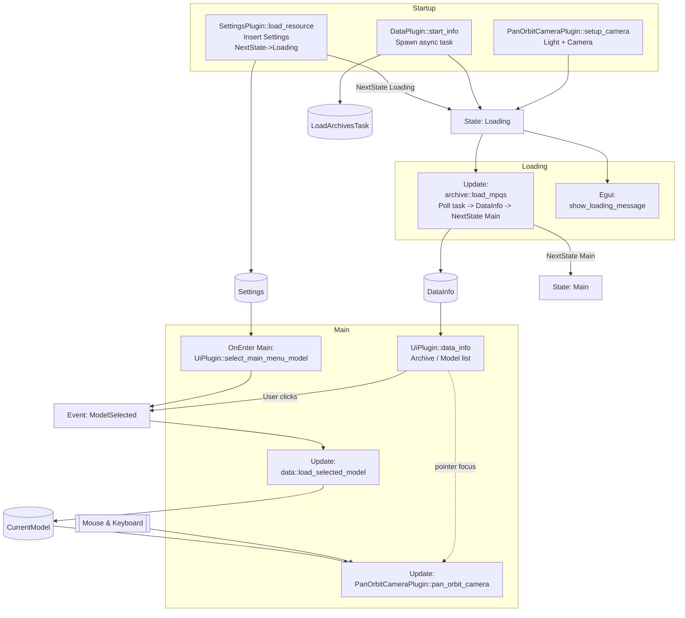

# Architecture

This document explains the current runtime architecture of the `worgen-rs` Bevy application: plugin ordering, states, system scheduling, and data / event flow, including an asynchronous archives loading task and a minimal loading UI.

## Plugin Composition

`main.rs` builds the `App` in this order:

1. `DefaultPlugins` – Core Bevy engine (rendering, input, asset system, schedules, etc.)
2. `FrameTimeDiagnosticsPlugin` – Frame timing diagnostics
3. `CustomMaterialPlugin` – Registers the custom material used for simple colored / textured meshes
4. `init_state::<GameState>()` – Registers the `GameState` state machine (`Startup` initial)
5. `EguiPlugin` – Integrates egui + adds the `EguiPrimaryContextPass`
6. `SettingsPlugin` – Loads settings during `Startup`, then requests transition to `Loading`
7. `LoadingPlugin` – Shows a centered egui window while in `Loading` state
8. `UiPlugin` – Declares `ModelSelected` event, selects initial model on `OnEnter(Main)`, shows archive/model browser UI once data is available
9. `DataPlugin` – Spawns async archive loading task (`Startup`), polls it (`Update`) inserting `DataInfo` when ready, loads selected model meshes (`Update`)
10. `PanOrbitCameraPlugin` – Spawns light + orbit camera (`Startup`), updates camera controls each frame (`Update`)

## Schedules & System Sets

Startup schedule systems:
- `SettingsPlugin::load_resource` – Inserts `Settings`, sets `NextState(GameState::Loading)`
- `DataPlugin::start_info` – Spawns async archive load task (`LoadArchivesTask` resource)
- `PanOrbitCameraPlugin::setup_camera` – Spawns light + orbit camera

State transitions:
1. `Startup` -> `Loading` (requested by settings load system)
2. `Loading` -> `Main` (requested when async archive task completes in `archive::load_mpqs` polling system inside `DataPlugin`)

Systems tied to states:
- `OnEnter(Main)`: `UiPlugin::select_main_menu_model` (emits initial `ModelSelected`)

Frame schedules of interest:
- `Update`: `archive::load_mpqs` (poll async task when `LoadArchivesTask` resource exists; inserts `DataInfo`, sets next state to `Main` on completion)
- `Update`: `load_selected_model` (in `data::mod.rs`; responds to most recent selection event and spawns meshes)
- `Update`: `PanOrbitCameraPlugin::pan_orbit_camera` – Orbit/pan/zoom input (skips when egui wants pointer)
- `EguiPrimaryContextPass`: `LoadingPlugin::show_loading_message` (only while in `Loading` state)
- `EguiPrimaryContextPass`: `UiPlugin::data_info` (only after `DataInfo` exists and state is `Main`)

Egui pass (`EguiPrimaryContextPass`):
- `UiPlugin::data_info` – Active in `Main` when `DataInfo` resource exists (lists archives, models, WMOs; emits `ModelSelected` on click)

## Data & Event Flow Summary

Resource & UI availability timeline:
1. `Settings` inserted in `Startup`
2. `LoadArchivesTask` inserted in `Startup` (async IO task running)
3. `LoadingPlugin` renders a non-interactive loading window during `Loading`
4. `DataInfo` inserted when task completes (during `Update` while in `Loading`)
5. State advances to `Main`; loading window disappears
6. Initial `ModelSelected` emitted in `OnEnter(Main)` (after `DataInfo` exists)

Run conditions:
- `UiPlugin::data_info` runs only if `DataInfo` exists
- Initial selection system (`select_main_menu_model`) only runs once on entering `Main`

User interaction (model selection) or the initial `OnEnter(Main)` selection both produce a `ModelSelected` event. `data::load_selected_model` consumes only the most recent event each frame (debounce) and respawns the `CurrentModel` entity/entities. M2 (character / doodad) meshes and WMO (world model object) group meshes are generated via separate module functions (`model::create_meshes_from_m2_path`, `world_model::create_meshes_from_wmo_path`).

Camera input is suppressed while the egui UI wants pointer focus to avoid conflicting interactions.

## Mermaid Diagram

## Execution Ordering Notes

- Asynchronous task (spawned in Startup) keeps the main thread responsive; polling occurs each `Update` while in `Loading`.
- Minimal loading window (egui) displays during `Loading`; it disappears automatically after transition.
- State transition to `Main` only occurs after `DataInfo` is inserted.
- `data::load_selected_model` processes only the final event each frame (debounce) during `Update`.

## Potential Enhancements

- Progress reporting: channel-based progress events (archives scanned, models parsed) with a progress bar replacing the static loading window.
- Parallel parsing: split archive reading and model/WMO parsing across task pool jobs for faster startup (consider backpressure and ordering).
- Error panel: collect and display non-fatal parsing errors in a collapsible diagnostics window instead of only logging.
- Hot reload / watch: file system watching of archive directory (dev mode) to refresh `DataInfo` incrementally when archives change.
- Asset abstraction: implement custom Bevy asset types for models and world models to leverage the asset server, caching, and dependency tracking.
- Memory & perf telemetry: lightweight counters (mesh count, vertex/index totals) surfaced in UI; optional frame-time overlay segment.
- Camera UX: inertia/smoothing, reset-to-origin action, optional focus on loaded model bounding box.

