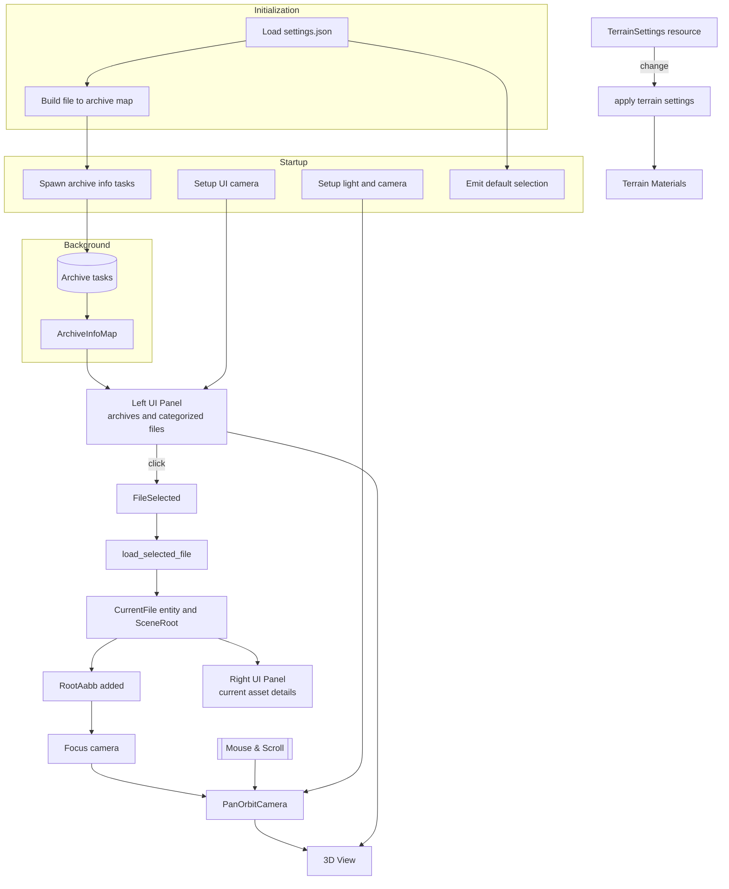

# Worgen-rs

This document describes the runtime architecture of the `worgen-rs` Bevy application: plugin order, system scheduling, asset/data loading, UI integration, camera control, and core abstractions. All details reflect the code under `src/`.

## High‑level overview

`worgen-rs` is a desktop 3D asset viewer that:
1. Reads configuration (`assets/settings.json`) before constructing the Bevy `App` (static singleton initialization).
2. Scans a `Data` directory for archive files and builds:
   * A global lowercase file → archive path map (fast resolution of virtual paths).
   * Per‑archive categorized file lists (textures, models, world models, world maps).
3. Exposes archives and categorized contents in a left egui panel with per‑file load state icons.
4. Loads at most one selected root asset at a time through the `AssetServer` using custom loaders for images, models, world models, and world maps.
5. Computes a root bounding box (`RootAabb`) and focuses a pan‑orbit camera automatically when a new scene root appears.
6. Shows a right details panel for the currently selected asset (images, meshes, materials, terrains, embedded models/world models, alpha maps, etc.).
7. Provides runtime inspection (types, materials, entities) via `bevy_inspector_egui` integrated inside the egui pass.

All file accesses use a virtual path scheme: `archive://relative/path`. A custom asset source resolves these paths by locating and reading files inside archives.

## Plugin composition (creation order in `main.rs`)

1. `ArchiveAssetReaderPlugin` – Registers the `archive://` virtual asset source backed by a custom synchronous reader.
2. `DefaultPlugins` – Standard Bevy plugins with asset metadata checks disabled (`AssetMetaCheck::Never`).
3. `SettingsPlugin` – Provides `TerrainSettings` and a system that propagates layer visibility changes (bitmask) to all existing extended terrain materials each frame they change.
4. `WorgenAssetPlugin` – Registers reflected components (`RootAabb`, `Model`, `WorldModel`, `WorldMap`), initializes the custom asset types/loaders (`ModelAsset`, `WorldModelAsset`, `WorldMapAsset`, extended terrain material), and builds the global file → archive map in `PreStartup`.
5. `FrameTimeDiagnosticsPlugin` – Frame timing metrics.
6. `EguiPlugin` – egui integration (adds the `EguiPrimaryContextPass` schedule and user texture management).
7. `DefaultInspectorConfigPlugin` – Integrates `bevy_inspector_egui` allowing inspection of registered reflected types and components inside the egui pass.
8. `UiPlugin` – Sets up the isolated UI camera & panels, registers / emits `FileSelected` events, dynamic viewport adjustment.
9. `DataPlugin` – Asynchronous archive scanning tasks, categorized file collection, selection & root scene entity lifecycle.
10. `PanOrbitCameraPlugin` – Directional light + camera spawn, automatic focus on new root AABBs, pan / orbit / zoom input handling.

`Settings::init()` runs once before plugin registration to populate a static `Settings` singleton (game path, optional default model path, test image path).

## Schedules & systems

PreStartup:
* `FileArchiveMap::init` – Builds a global lowercase file path → archive path map by scanning all archives.

Startup:
* `archive::start_loading` – Spawns async tasks (one per archive) to extract categorized file lists.
* `ui::select_default_model` – Emits a `FileSelected` event if a default model path is configured.
* `camera::setup_camera` – Spawns directional light + pan‑orbit camera entity.
* `ui::setup_ui` – Creates a dedicated UI 2D camera (isolated render layers) and disables automatic primary egui context creation.

PreUpdate:
* `camera::on_world_map_loaded` – Focus when a world map `RootAabb` appears.
* `camera::on_world_model_loaded`, `camera::on_model_loaded` – Focus when a world model or model `RootAabb` appears (only run while no world map is present to avoid double focusing).

Update:
* `archive::check_archive_loading` (conditional while `LoadArchiveTasks` exists) – Polls archive categorization tasks; populates `ArchiveInfoMap` or triggers an error exit on failure.
* `data::load_selected_file` – Responds to the newest `FileSelected` event, despawns & unloads the prior `CurrentFile`, loads the newly selected asset (root label), and spawns an entity with `CurrentFile` + `SceneRoot`.
* `camera::pan_orbit_camera` – Processes accumulated mouse motion & scroll (pan/orbit/zoom) unless pointer is captured by egui.
* `settings::apply_terrain_settings` – Propagates `TerrainSettings` changes (recomputes a 4‑bit `level_mask`).

Egui (`EguiPrimaryContextPass`):
* `ui::data_info` – Renders left archive browser + right current file details panels and adjusts world camera viewport to exclude panel widths.

## Core runtime data

Resources:
* `ArchiveInfoMap` – Archive path → categorized lists (texture, model, world model, world map paths).
* `FileInfoMap` – Lowercase file path → `FileInfo` (original path, owning archive, inferred `DataType`, load/unload helpers, recursive load state lookup).
* `LoadArchiveTasks` – In‑flight asynchronous archive categorization tasks.
* `TerrainSettings` – User flags controlling visibility of up to four terrain texture layers (bitmask mapped to `TerrainMaterial.level_mask`).

Global singletons:
* `Settings` – Static configuration loaded from JSON (game root path, test image/model path overrides).
* `FileArchiveMap` – Static map from file path → archive path used by the custom asset reader (read‑only after init).

Events:
* `FileSelected { file_path }` – Issued by the UI or startup logic to request a new root asset load (debounced to newest per frame).

Components:
* `CurrentFile { path }` – Marks the entity holding the scene root for the currently selected asset (used by right panel & unload logic).
* `PanOrbitState`, `PanOrbitSettings` – Pan/orbit/zoom camera state & configuration (keys: Ctrl=pan, Alt=orbit, Shift=zoom, scroll=zoom).
* `RootAabb` – Axis‑aligned bounding box derived from meshes (or terrain chunks) after consistent reorientation.
* `Model`, `WorldModel`, `WorldMap` – Marker components identifying scene root types for focus logic & UI introspection.
* `TerrainMaterial` – Extension payload of `ExtTerrainMaterial` storing layer textures, combined alpha map, layer count and bitmask.

## File classification

`FileInfoMap` infers a `DataType` from extension:
* `Texture` – Texture file.
* `Model` – Standard 3D model.
* `WorldModel` – Large static multi‑group structure (root file only, group files are implicit).
* `WorldMap` – Terrain map with chunks, embedded models/world models, textures & alpha masks.
* `Unknown` – Any other file (ignored by selection logic).

Dependencies (textures, group files, embedded assets) are scheduled by loaders; the UI only triggers root asset loads.

## Virtual asset source

The `ArchiveAssetReaderPlugin` registers the `archive` source. Resolution steps:
1. Lowercase the requested relative path.
2. Look up owning archive via `FileArchiveMap`.
3. Open archive and read file bytes (synchronously per request; Bevy orchestrates async scheduling at a higher level).

## Asset loaders

Common pattern: parse bytes → enqueue/load dependent assets (images, group files) → create meshes & materials → build a `Scene` with a consistent reorientation (rotate −90° X then −90° Z) → compute `RootAabb` → label sub‑assets for partial handle loading.

Loaders:
* Image loader – Decodes image format into RGBA `Image` assets, applying per‑texture sampler descriptors derived from format flags.
* Model loader – Parses model structure, resolves texture handles (fallback to configured test image when missing), builds per‑batch meshes & materials. Geoset grouping logic ensures only one variant of mutually exclusive categories is visible at spawn to avoid overdraw.
* World model loader – Parses root file, loads all group files, builds meshes per render batch, applies material flags (alpha blending, two‑sided, unlit, sampler modes), constructs a scene with `WorldModel` marker and child mesh entities.
* World map loader – Parses terrain definition, generates one mesh per chunk (145 vertices, 256 CCW triangles via 4‑triangle fan per quad), creates a combined RGBA alpha texture per chunk, builds extended terrain materials carrying up to 4 texture layers + alpha mask, requests referenced models & world models, places them with orientation & scale adjustments, and labels all sub‑assets (chunks, materials, combined alpha, models, world models, images).

## Terrain material & settings propagation

`ExtTerrainMaterial` = `StandardMaterial` + `TerrainMaterial` extension (combined alpha map + up to three additional layer textures + counts + layer mask). `TerrainSettings` recomputes a 4‑bit `level_mask` (bit per layer) applied to every existing extended terrain material when changed.

## UI layer

Two dynamic side panels:
* Left (Archives) – Collapsible archive headers → categorized file groups. Each file row: icon by type (🖼 texture, 📦 model, 🏰 world model, 🗺 world map, ❓ unknown) + load state overlay (▶ not loaded, ⏳ loading, ✔ loaded, ✖ failed). Clicking (non‑tooltip) emits `FileSelected`.
* Right (Current) – When a file is selected, shows a scrollable inspector-driven entity view (root + sub‑entities) including image previews & sampler parameters for images and terrain alpha/layer textures.

Viewport management: The UI camera renders only egui (isolated render layers). After each frame the main 3D camera viewport is shrunk horizontally to exclude the occupied left/right panel widths minimizing wasted rendering under opaque UI.

## Selection & scene lifecycle

1. User clicks a file row → `FileSelected` event.
2. Handler retains only the newest event per frame (debounce for rapid clicking).
3. If the selected path differs: previous `CurrentFile` entity is despawned & its asset handle unloaded; new root asset loaded via labeled path (`ModelAssetLabel::Root`, `WorldModelAssetLabel::Root`, `WorldMapAssetLabel::Root`).
4. An entity with `CurrentFile` + `SceneRoot(handle)` spawns.
5. Loader completion spawns the scene (with root marker + `RootAabb`), triggering camera focus in `PreUpdate`.

## Camera & focusing

Pan‑orbit controller:
* Inputs: Control = pan, Alt = orbit, Shift = zoom, scroll wheel = zoom (all adjustable through `PanOrbitSettings`).
* Aggregates all mouse motion & scroll events; exponential zoom scaling; yaw/pitch wrap & upside‑down horizontal inversion.

Focus logic: sets center to AABB center and radius to max(length(half_extents) * comfort, minimum). Yaw/pitch preserved; only center, radius and camera translation update.

## Bounding volumes

`RootAabb` utilities derive a combined AABB from one or many meshes (optionally transformed). For terrains a merged bounding box is computed from chunk meshes prior to focus. Reorientation occurs before measurement to ensure consistent camera framing across asset types.

## Error handling & load states

* Archive task errors log the cause and request application error exit.
* Asset load failures surface as ✖ with tooltips for messages; previous scene persists (no implicit retry).
* Load state progression is derived from recursive dependency states (root + sub‑assets) to reflect readiness for viewing.

## Concurrency

* Archive categorization: one async IO task per archive, polled each frame (unfinished tasks re‑queued).
* Asset pipeline: standard Bevy asynchronous loading; only root selection & unloading logic is custom.

## Execution notes

* Only the newest selection per frame is processed (debounce during rapid clicks).
* A uniform reorientation (−90° X, −90° Z) yields consistent forward/up for all asset categories.
* Terrain layer visibility toggles update material bitmasks in place (no asset reload).
* Model geoset visibility: mutually exclusive geoset categories ensure only one variant renders for overlapping cosmetic groups.

## Mermaid overview

## Potential enhancements

1. Replace static `Settings` with a reloadable Bevy resource (hot‑reload, thread safety, dynamic path changes).
2. File watching & incremental refresh of `ArchiveInfoMap` / `FileInfoMap` when archives are added/removed.
3. Progressive / streaming world map loading with frustum or distance prioritization.
4. Cached or pooled archive reads to amortize open/seek cost; optional memory mapping.
5. Asset caching / LRU eviction to bound memory usage during long sessions.
6. Smooth camera focus tween or eased dolly instead of instantaneous reposition.
7. User‑configurable input mapping & gamepad support for camera/navigation.
8. Expanded diagnostics (counts, memory estimates, per‑category timings) in a dedicated panel beyond raw inspector data.
9. Failure & retry panel for individual asset load errors (manual retry + logs consolidation).
10. Terrain material/shader upgrades: normal mapping, triplanar blend, texture arrays to reduce bind group churn.
11. Parallel world model group loading progress visualization (incremental readiness feedback).
12. Headless validation mode for CI (batch load assets, report failures, produce summary JSON).
13. Mesh & material merging or instancing passes to reduce draw calls after load.
14. Spatial culling structures (chunk / cell / BVH) for large scenes & maps.
15. Incremental loading of embedded model/world model placements (prioritize camera‑proximate instances first).
16. Skip allocation of alpha textures that are fully uniform (black/transparent) and reuse a shared handle.
17. Store parsed model/world model metadata directly on components (instead of relying only on handles) for faster UI queries & modification.
18. Graceful handling & warning (not fatal exit) for missing or malformed archives; hot reload on reappearance.
