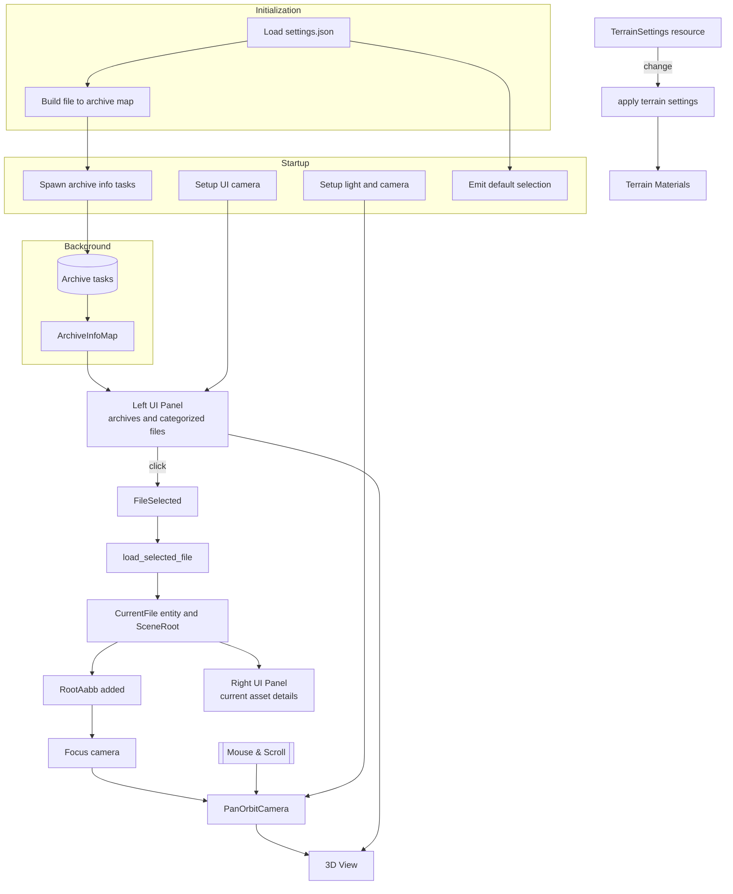

# Worgen-rs

This document describes the current runtime architecture of the `worgen-rs` Bevy application: plugin order, system scheduling, asset/data loading flow, UI integration, camera control, and core abstractions. It reflects only the present code under `src/`.

## High‑level overview

`worgen-rs` is a desktop 3D asset viewer that:
1. Reads configuration (`assets/settings.json`) before building the Bevy `App`.
2. Scans a game `Data` directory for archive files and builds two indices:
   * A global file → archive map for on‑demand asset IO.
   * Per‑archive categorized file lists (textures, models, world models, world maps).
3. Presents archives and their categorized contents in an egui UI (left panel) with load state indicators.
4. Loads exactly one selected top‑level asset at a time through the `AssetServer`, using custom loaders for images, models, world models and world maps.
5. Spawns and focuses a pan‑orbit camera on the loaded scene using an automatically computed bounding box.
6. Provides a details panel (right side) showing the structure (sub‑assets) of the currently selected item (images, materials, meshes, terrains, embedded models, etc.).

All file accesses use a virtual path scheme: `archive://relative/path`. A custom asset source resolves these paths by locating and reading files inside archives.

## Plugin composition (creation order in `main.rs`)

1. `ArchiveAssetReaderPlugin` – Registers the `archive://` asset source with a custom `AssetReader`.
2. `DefaultPlugins` – Standard Bevy plugins with asset metadata checks disabled.
3. `SettingsPlugin` – Inserts runtime tweakable `TerrainSettings` and propagates changes to terrain materials.
4. `WorgenAssetPlugin` – Registers reflected types (`RootAabb`, `Model`, `WorldModel`, `WorldMap`), initializes corresponding asset types, loaders, the terrain extended material, and runs `FileArchiveMap::init` in `PreStartup`.
5. `FrameTimeDiagnosticsPlugin` – Frame timing metrics.
6. `EguiPlugin` – egui integration (adds the `EguiPrimaryContextPass` schedule).
7. `UiPlugin` – UI camera setup and panel rendering systems; defines the `FileSelected` event.
8. `DataPlugin` – Archive discovery task orchestration, archive info storage, file selection & loading logic.
9. `PanOrbitCameraPlugin` – Directional light + camera spawn, focus on load, pan/orbit/zoom input, animated sun rotation.

`Settings::init()` runs once before plugin registration to populate a static `Settings` singleton (game path, fallback test asset paths).

## Schedules & systems

PreStartup:
* `FileArchiveMap::init` – Builds a global lowercase file path → archive path map by scanning all archives.

Startup:
* `archive::start_loading` – Spawns async tasks (one per archive) to extract categorized file lists.
* `ui::select_default_model` – Emits a `FileSelected` event if a default model path is configured.
* `camera::setup_camera` – Spawns directional light + pan‑orbit camera entity.
* `ui::setup_ui` – Creates a dedicated UI 2D camera (isolated render layers) and disables automatic primary egui context creation.

PreUpdate:
* `camera::on_world_map_loaded` – Focus when a world map `RootAabb` appears.
* `camera::on_world_model_loaded`, `camera::on_model_loaded` – Focus when a world model or model `RootAabb` appears (only run while no world map is present to avoid double focusing).

Update:
* `archive::check_archive_loading` (conditional while `LoadArchiveTasks` exists) – Polls archive extraction tasks; populates `ArchiveInfoMap` or triggers an error exit on failure.
* `data::load_selected_file` – Responds to the newest `FileSelected` event, despawns / unloads the prior `CurrentFile`, loads the newly selected asset (root label), and spawns an entity with `CurrentFile` + `SceneRoot`.
* `camera::pan_orbit_camera` – Processes mouse motion + scroll (pan/orbit/zoom) unless pointer is captured by egui.
* `camera::rotate_sun` – Slowly animates directional light rotation.
* `settings::apply_terrain_settings` – Propagates `TerrainSettings` bitmask changes to all existing extended terrain materials.

Egui (`EguiPrimaryContextPass`):
* `ui::data_info` – Renders left archive browser + right current file details panels and adjusts world camera viewport to exclude panel widths.

## Core runtime data

Resources:
* `ArchiveInfoMap` – Archive path → lists of contained texture, model, world model, world map paths.
* `FileInfoMap` – Lowercase file path → `FileInfo` (archive path + inferred `DataType` + load state helpers).
* `LoadArchiveTasks` – In‑flight asynchronous archive info extraction tasks.
* `TerrainSettings` – User‑modifiable flags controlling which terrain texture levels are visible (propagated live to materials).

Global singletons:
* `Settings` – Static configuration loaded from JSON (game root path, test image/model path overrides).
* `FileArchiveMap` – Static map from file path → archive path used by the custom asset reader (read‑only after init).

Events:
* `FileSelected { file_path }` – Issued by the UI or startup logic to request a new root asset load.

Components:
* `CurrentFile { path }` – Marks the entity holding the scene root for the currently selected asset.
* `PanOrbitState`, `PanOrbitSettings` – Camera controller runtime state and configuration.
* `RootAabb` – Axis‑aligned bounding box calculated by loaders; used to focus the camera.
* Marker components: `Model`, `WorldModel`, `WorldMap` – Identify scene root types for focus logic.

## File classification

`FileInfoMap` infers a `DataType` from extension:
* `Texture` – Texture file.
* `Model` – Standard 3D model.
* `WorldModel` – Large static multi‑group structure (root file only, group files are implicit).
* `WorldMap` – Terrain map with chunks, embedded models/world models, textures & alpha masks.
* `Unknown` – Any other file (ignored by selection logic).

Dependencies (textures, group files, embedded assets) are scheduled by loaders; the UI only triggers root asset loads.

## Virtual asset source

The `ArchiveAssetReaderPlugin` registers the `archive` source. Resolution steps:
1. Lowercase the requested relative path.
2. Look up owning archive via `FileArchiveMap`.
3. Open archive and read file bytes (synchronously per request; Bevy orchestrates async scheduling at a higher level).

## Asset loaders

Common pattern: parse bytes → request dependent assets → create meshes/materials → build a `Scene` with a reorientation (rotate −90° X then −90° Z) → compute `RootAabb` → label sub‑assets.

* Image loader – Decodes texture bytes into `Image` objects (RGBA) with appropriate sampler customization (for world model flags).
* Model loader – Parses model, resolves texture handles (falling back to configured test image when needed), builds per‑batch meshes and materials, assembles a scene with `Model` marker + children, computes bounding box, labels meshes/materials/images.
* World model loader – Parses root file, loads group files, applies per‑material flags (alpha, culling, unlit, sampler), builds meshes per render batch, constructs scene with `WorldModel` marker and labeled assets.
* World map loader – Parses terrain definition, creates one mesh per chunk (145‑vertex pattern), generates combined RGBA alpha map textures (one per chunk), creates extended terrain materials (`ExtTerrainMaterial`), requests referenced models/world models, places them with transforms, and labels all sub‑assets.

## Terrain material & settings propagation

`ExtTerrainMaterial` extends `StandardMaterial` with channel‑based alpha & optional up to three higher layer textures. Runtime `TerrainSettings` toggles layer visibility by updating a bitmask (`level_mask`) across all existing terrain materials whenever the resource changes.

## UI layer

Two dynamic side panels:
* Left: Archive browser – Collapsible archive headers → categorized file sections. Rows show load state icon (▶ not loaded, ⏳ loading, ✔ loaded, ✖ failed) and emit `FileSelected` on click (tooltip clicks ignored).
* Right: Current file details – Shows nested collapsible groups for images, materials, meshes, terrains, embedded models, world models, alpha maps, plus bounding box.

The UI camera is isolated via render layers. After each UI frame the primary 3D camera viewport is resized to exclude occupied left/right panel widths, preventing overdraw beneath the UI.

## Selection & scene lifecycle

1. User clicks a file entry → `FileSelected`.
2. `load_selected_file` keeps only the most recent selection this frame.
3. If it differs from current: previous `CurrentFile` entity is despawned and its asset handle reset (allowing reload on reselect); new asset root label is loaded (`ModelAssetLabel::Root`, `WorldModelAssetLabel::Root`, `WorldMapAssetLabel::Root`).
4. A new entity with `CurrentFile` + `SceneRoot(handle)` spawns.
5. When loader finishes and its scene spawns, a `RootAabb` component triggers camera focusing in `PreUpdate`.

## Camera & focusing

Pan‑orbit controller:
* Modifier keys (Control = pan, Alt = orbit, Shift = zoom) + scroll wheel (zoom) configurable via `PanOrbitSettings`.
* Accumulates all mouse motion and scroll events each frame; zoom uses exponential scaling of radius.
* Maintains yaw/pitch with wrapping; detects upside‑down state to invert horizontal orbit appropriately.

Focusing logic sets center to AABB center and radius to max(length(half_extents) * comfort, minimum). Manual yaw/pitch preserved between loads; only center/radius/position update.

## Bounding volumes

`RootAabb` utilities support deriving from multiple meshes with an optional transform. For map terrains a merged bounding box is computed from transformed chunk meshes. Consistent reorientation occurs before measurement.

## Error handling & load states

* Archive extraction errors log the cause and request application error exit.
* Asset load errors surface as ✖ with tooltip message in the UI.
* Selecting a failed asset leaves the previous scene intact (no retry yet).

## Concurrency

* Archive info extraction: one async task per archive polled each frame (unfinished tasks re‑queued).
* Asset pipeline: standard Bevy asynchronous loader path; only root selection logic is custom.

## Execution notes

* Only the most recent selection per frame is processed (debounce for rapid clicking).
* Reorientation is identical across loaders ensuring consistent camera framing.
* Terrain layer visibility changes propagate instantly without reloading assets.

## Mermaid overview

## Potential enhancements

1. Replace static `Settings` with a reloadable Bevy resource (hot‑reload, thread safety).
2. File watching for incremental refresh of `ArchiveInfoMap` and `FileInfoMap`.
3. Progressive world map streaming / frustum priority for large maps.
4. Batched or cached archive reads to reduce repetitive open/seek overhead.
5. Optional asset caching or LRU eviction to cap memory over long sessions.
6. Smooth camera focus tween instead of instantaneous jump.
7. Configurable input mapping + gamepad support.
8. Diagnostics panel (counts, memory estimates, timing per category / loader).
9. Dedicated failure panel with retry for individual assets.
10. Terrain shader upgrades (normal mapping, triplanar, texture arrays to reduce bind group churn).
11. Parallel world model group loading progress indicator.
12. Headless validation mode for CI asset integrity checks.
13. Mesh/material merge passes to reduce draw calls post‑load.
14. Hierarchical or per‑chunk culling structures for large scenes.
15. Incremental loading of embedded models/world models for world maps (prioritize nearby placements).

